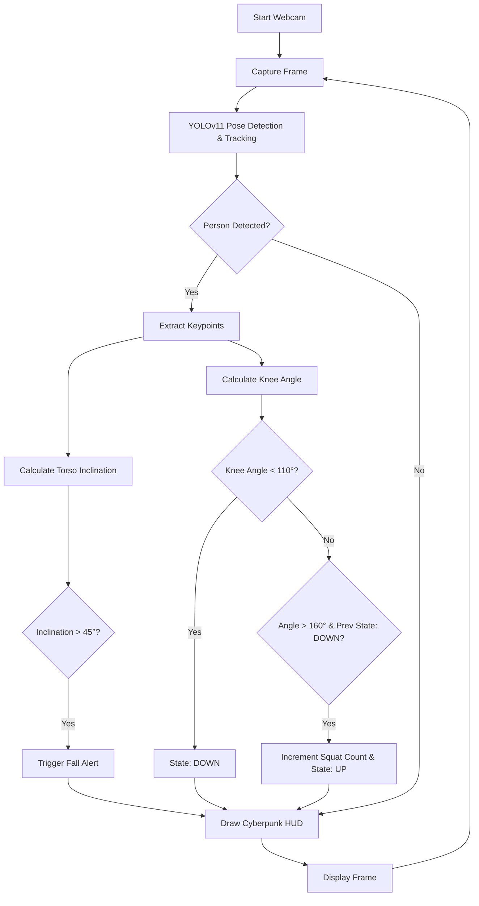
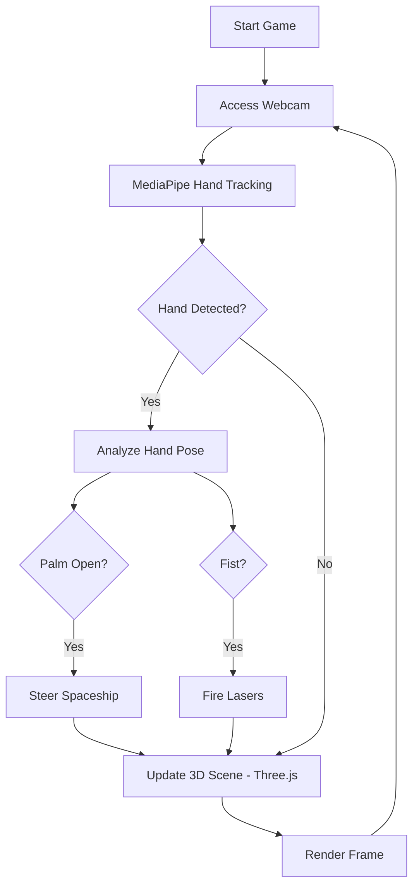

# Computer Vision & Real-Time Tracking Suite 

[](https://www.python.org/)
[](https://github.com/ultralytics/ultralytics)
[](https://google.github.io/mediapipe/)
[](https://opencv.org/)
[](https://github.com/vishva2410/Computer-Vision-and-Live-Tracking-Projects)

Welcome to the **Computer Vision & Live Tracking Suite**! This repository showcases advanced real-time Human-Computer Interaction (HCI) and biometric analysis projects using state-of-the-art AI models like YOLOv11 and MediaPipe.

---

##  Project Portfolio

### 1. TitanPose Advanced (YOLOv11) 
A high-performance human behavior analysis system designed for gym analytics and safety monitoring. It uses vector geometry to analyze posture and movement in real-time.

*   ** Tech Stack:** `YOLOv11`, `OpenCV`, `NumPy`, `Vector Math`.
*   ** Key Features:**
    *   ** Squat Counter:** Automated exercise tracking using knee flexion analysis.
    *   ** Fall Detection:** Real-time monitoring of spinal inclination with "Red Alert" HUD.
    *   **Cyberpunk HUD:** Futuristic overlay with FPS logging and system status.
*   ** Entry Point:** [`main.py`](./main.py)

####  Logic Flow


---

### 2. Hand Gesture Recognition 
A lightweight gesture control system that tracks 21 hand landmarks to identify specific poses and directional movement.

*   ** Tech Stack:** `MediaPipe Hands`, `OpenCV`.
*   ** Key Features:**
    *   **Real-time Tracking:** Low-latency detection of single/multiple hands.
    *   **Pose Logic:** Geometric analysis to distinguish "Open Palm" vs "Fist".
*   ** Entry Point:** [`hand_gesture.py`](./hand_gesture.py)

---

### 3. Gesture Racer 3D 
An immersive web-based infinite racing game where you control a spaceship using hand gestures.

*   ** Tech Stack:** `Three.js` (R3F), `MediaPipe` (Web), `React`, `Zustand`.
*   ** Key Features:**
    *   **Hand Steering:** Move palm to fly the spaceship.
    *   **Combat:** Close your hand into a **FIST** to shoot lasers.
    *   **Procedural World:** Infinite cities and dynamic enemy encounters.
*   ** Location:** [`/gesture-racer`](./gesture-racer)

####  Game Flow


---

##  Installation & Setup

### Prerequisites
*   Python 3.11+
*   Node.js (for Gesture Racer)

### 1. Clone the Repository
```bash
git clone https://github.com/vishva2410/Computer-Vision-and-Live-Tracking-Projects.git
cd Computer-Vision-and-Live-Tracking-Projects
```

### 2. Python Setup (TitanPose & Hand Gesture)
```bash
pip install -r requirements.txt
```

### 3. Web Setup (Gesture Racer)
```bash
cd gesture-racer
npm install
npm run dev
```

---

##  How to Run

**Run TitanPose Body Tracker:**
```bash
python main.py
```

**Run Hand Gesture Tracker:**
```bash
python hand_gesture.py
```

---
**Author:** [Vishva](https://github.com/vishva2410)
**Focus:** Real-time Human-Computer Interaction (HCI) & Biometric Analysis.
